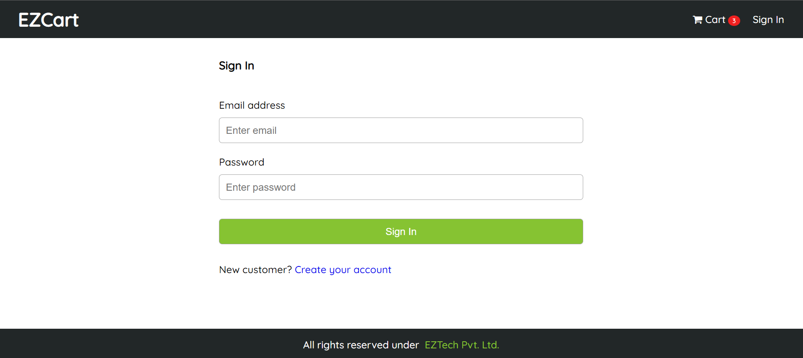

# EZ-Cart ECommerce Website

## Screenshots
<h3>Home Page</h3>

 

<h3>Product Page</h3>

 

  
<h3>Sign-In Page</h3>

 

  
<h3>Cart Page</h3>

 

  
<h3>Shipping Address Page</h3>

 

<h3>Payment Method Page</h3>

 

<h3>Place Order Page</h3>

 

<h3>Order Summary Page without Payment</h3>

 

<h3>Order Summary Page after Payment</h3>

 

<h3>User Profile Page</h3>

 

<h3>Order History Page</h3>

 

